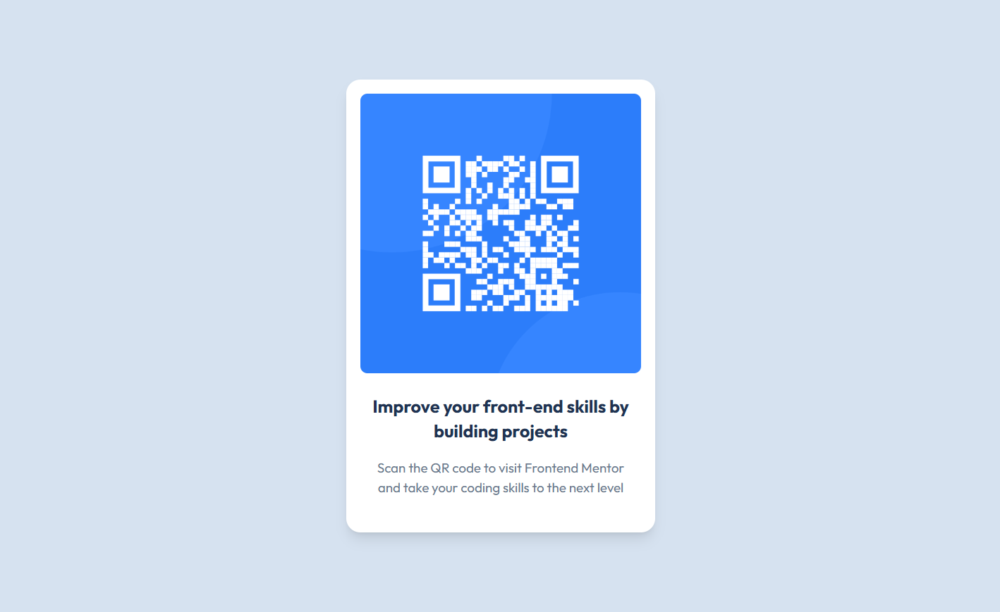

# 🧩 Proyecto: Componente QR Code

Este proyecto consiste en el desarrollo de un componente de Código QR utilizando Astro y Tailwind CSS.  
El objetivo es aplicar los conocimientos sobre componentes, maquetación, estilos responsivos y utilidades CSS para construir un diseño limpio, moderno y adaptable a diferentes dispositivos.

---

## 📖 Descripción general

### 🧩 Vista previa del proyecto
*Capturas de Pantalla*
## Vista Previa

| Desktop Version | Mobile Version |
| :---: | :---: |
|  |  |

---

### 🔗 Enlaces del proyecto

- **Repositorio en GitHub:** https://github.com/MartinITAAgs/QR-Code-Component-
- **Sitio desplegado (opcional):** Vercel: https://major-main-5nghscak0-mmichifus7-8198s-projects.vercel.app/

---

## 🧠 Proceso de desarrollo

### 🛠️ Tecnologías utilizadas
Lista las herramientas y tecnologías que utilizaste en el proyecto. Por ejemplo:

- [Astro](https://astro.build)
- [Tailwind CSS](https://tailwindcss.com/)
- HTML5 semántico
- Diseño responsivo (Mobile-first)
- Componentes reutilizables

---

### 💡 Lo que aprendí
En esta sección describe brevemente **qué aprendiste o reforzaste** al desarrollar este proyecto.  
Puedes incluir fragmentos de código o mencionar conceptos nuevos que aplicaste.


  En este trabajo se ha aprendido de la nueva forma para otorgar el diseño a través de Tailwind, pareciendo rebuscados con líneas tales como:
  <main class="bg-white rounded-2xl shadow-lg p-4 w-[320px] md:w-[375px] lg:w-[350px] text-center">
  donde parecen tener poco orden. Se considera que tras practicar más, sería algo bueno para optimizar líneas y procesos.

```
  
---

### 🚀 Áreas de mejora

Menciona aquí los aspectos que podrías mejorar o seguir practicando en futuros proyectos.

 
- Explorar el uso de variables de Tailwind personalizadas. Se espera que la experiencia facilite este punto. 
- Optimizar la estructura del proyecto y el uso de componentes. Aún no se ha trabajado demasiado pero los resultados ahn sido satisfactorios para este proyecto sencillo. 

---

### 📚 Recursos útiles

Incluye los enlaces, documentación o tutoriales que te ayudaron a completar este proyecto.

- Documentación de :
  https://tailwindcss.com/docs/installation/using-vite
  https://docs.astro.build/es/getting-started/
 

---

### 👩‍💻 Autor

- **Nombre completo: Martín de Jesús Ramírez Rodríguez** 
- **Carrera: ingeniería en Tecnologías de la Información y Comunicaciones**  
- **Grupo: 11:00 am**  
- **Correo institucional: 23151193@aguascalientes.tecnm.mx**  

---

### ✨ Reflexión final

Comparte brevemente tu experiencia durante el desarrollo del proyecto.  
Puedes responder a preguntas como:

- ¿Qué fue lo más fácil o lo más difícil de realizar?
    Idear la responsividad y diseño ahn sido sencillos, lo dificil ha sido indagar en el nuevo formato de Tailwind para implementar el diseño.
- ¿Qué parte disfrutaste más del desarrollo?  
    Aprender una nueva forma de trabajar el frontend ha sido nutritivo.

